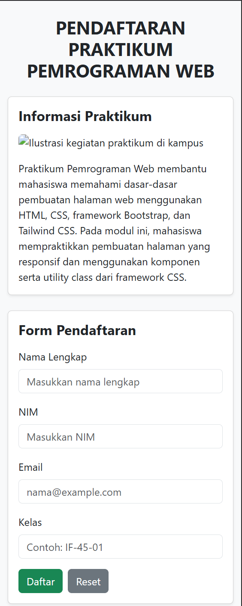
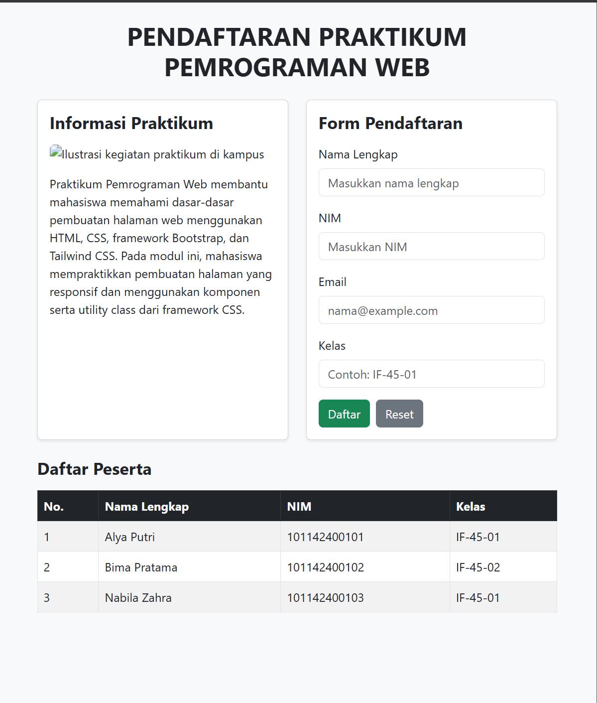
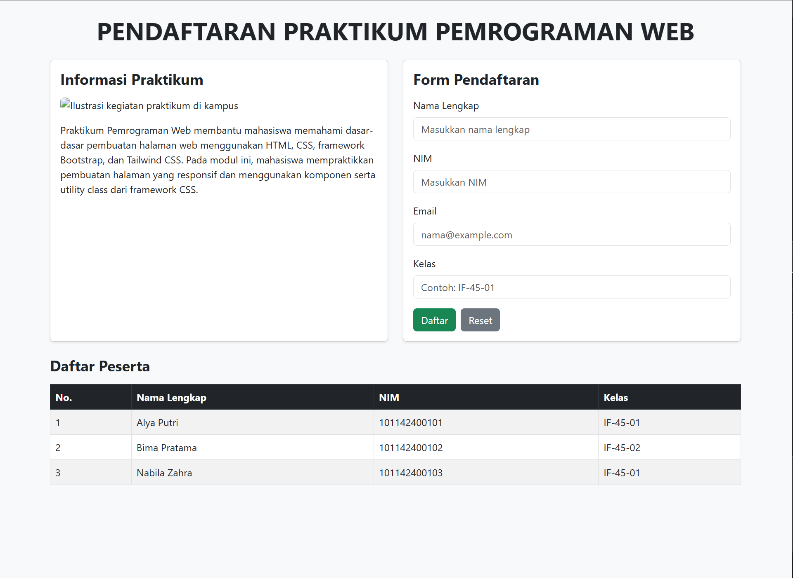
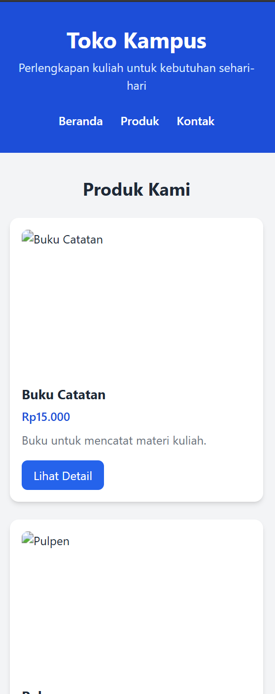
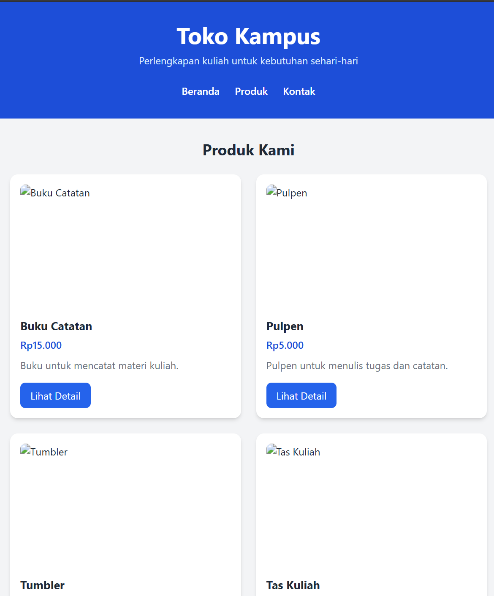
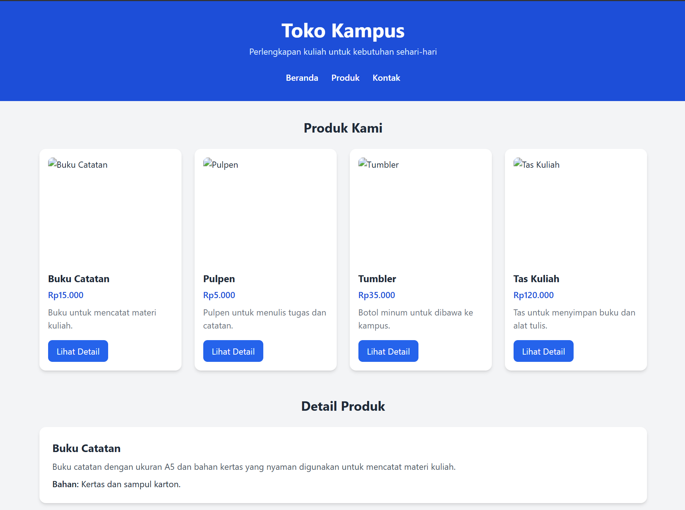

# 04_Praktikum_Bootstrap_dan_Tailwind_CSS


## Nama : Haryanto Wifakul Azmi  
## Kelas : SE-08-02  
## Nim : 103122400037  

---

## Soal

### Soal 1. Bootstrap — Pendaftaran Peserta Praktikum

Buat halaman pendaftaran peserta Praktikum Pemrograman Web menggunakan Bootstrap 5.3.0 (CDN). Halaman harus memuat informasi praktikum, form pendaftaran, serta tabel peserta.

Tugas:

1. Tampilkan judul "Pendaftaran Praktikum Pemrograman Web" dengan teks rata tengah, huruf kapital, dan cetak tebal menggunakan class Bootstrap.
2. Gunakan container dan grid Bootstrap. Pada lebar layar minimal 768 px, informasi praktikum berada di kiri dan form di kanan dengan lebar sama. Pada layar lebih kecil, informasi berada di atas form.
3. Bagian informasi memuat satu gambar dengan class `img-fluid` dan atribut `alt`, serta deskripsi singkat praktikum. Gambar disimpan di folder `assets`.
4. Buat form berisi Nama Lengkap, NIM, Email, dan Kelas dengan label yang terhubung ke input, class `form-control`, atribut `required`, dan Email menggunakan `type="email"`.
5. Sediakan tombol "Daftar" berwarna hijau (submit) dan "Reset" berwarna abu-abu (reset).
6. Buat tabel peserta menggunakan `table`, `table-striped`, `table-bordered`, `table-hover`, dibungkus `table-responsive`, berisi tiga data contoh.

### Soal 2. Tailwind CSS — Katalog Perlengkapan Kuliah

Buat halaman katalog "Toko Kampus" menggunakan Tailwind CSS (Play CDN). Halaman memuat navigasi, empat kartu produk, bagian detail produk, dan kontak.

Tugas:

1. Buat beranda dengan judul "Toko Kampus", deskripsi "Perlengkapan kuliah untuk kebutuhan sehari-hari", dan navigasi Beranda, Produk, Kontak menggunakan flexbox.
2. Tampilkan empat kartu produk dengan grid: 1 kolom (< 640 px), 2 kolom (640–1023 px), 4 kolom (≥ 1024 px) menggunakan prefix `sm:` dan `lg:`.
3. Setiap kartu memuat gambar, nama, harga, deskripsi singkat, dan tombol "Lihat Detail" dengan latar putih, padding, sudut membulat, dan bayangan.
4. Tombol berlatar biru dengan teks putih, dan lebih gelap saat di-hover menggunakan `hover:`.
5. Tambahkan bagian detail untuk masing-masing produk, dengan tombol "Lihat Detail" mengarah ke detail yang sesuai melalui anchor dan `id`.
6. Tambahkan bagian Kontak berisi "Toko Kampus" dan email `toko@example.com`.

---

## Kode Sumber

* Soal 1 (Bootstrap): [`soal_bootstrap.html`](soal_bootstrap.html)
* Soal 2 (Tailwind CSS): [`soal_tailwind.html`](soal_tailwind.html)
* Folder aset gambar: [`assets/`](assets/)

---

## Deskripsi

Praktikum ini bertujuan menerapkan konsep **CSS Framework** pada pembuatan halaman web yang responsif, yaitu **Bootstrap** yang berbasis komponen dan **Tailwind CSS** yang berbasis utility class.

Soal 1 membuat halaman pendaftaran peserta praktikum dengan Bootstrap 5.3.0. Soal 2 membuat katalog produk "Toko Kampus" dengan Tailwind CSS melalui Play CDN. Kedua halaman dibuat dalam file HTML terpisah dengan struktur HTML5, atribut `lang="id"`, dan meta viewport.

---

## Soal 1. Bootstrap

### 1. Menghubungkan Bootstrap

Bootstrap 5.3.0 dihubungkan di dalam `<head>` menggunakan CDN CSS.

```html
<link rel="stylesheet"
      href="https://cdn.jsdelivr.net/npm/bootstrap@5.3.0/dist/css/bootstrap.min.css">
```

Penjelasan:

* CDN digunakan agar tidak perlu mengunduh file Bootstrap secara manual
* Class Bootstrap seperti `container`, `row`, `col-*`, `card`, dan `btn` langsung dapat digunakan
* `<body class="bg-light">` memberi latar abu-abu muda pada halaman

---

### 2. Judul Halaman

```html
<main class="container py-4">
    <h1 class="text-center text-uppercase fw-bold mb-4">
        Pendaftaran Praktikum Pemrograman Web
    </h1>
```

Penjelasan:

* `container` membungkus konten agar lebarnya terbatas dan berada di tengah
* `py-4` memberi padding atas dan bawah
* `text-center` membuat teks rata tengah
* `text-uppercase` mengubah teks menjadi huruf kapital
* `fw-bold` membuat teks tebal
* `mb-4` memberi jarak bawah

---

### 3. Grid Informasi dan Form

```html
<div class="row g-4">
    <section class="col-12 col-md-6"> ... </section>
    <section class="col-12 col-md-6"> ... </section>
</div>
```

Penjelasan:

* `row` membuat baris grid dan `g-4` memberi jarak (gutter) antarkolom
* `col-12` membuat tiap bagian memenuhi lebar penuh pada layar kecil, sehingga informasi tampil di atas form
* `col-md-6` membuat tiap bagian berlebar 50% pada layar minimal 768 px, sehingga informasi di kiri dan form di kanan
* Urutan di HTML menentukan posisi, yaitu informasi lebih dulu daripada form

---

### 4. Bagian Informasi Praktikum

```html
<div class="card h-100 shadow-sm">
    <div class="card-body">
        <h2 class="h4 fw-bold mb-3">Informasi Praktikum</h2>

        

        <p class="mb-0">
            Praktikum Pemrograman Web membantu mahasiswa memahami
            dasar-dasar pembuatan halaman web menggunakan HTML, CSS,
            framework Bootstrap, dan Tailwind CSS. ...
        </p>
    </div>
</div>
```

Penjelasan:

* `card` dan `card-body` membuat tampilan kartu
* `h-100` membuat tinggi kedua kartu sama
* `shadow-sm` memberi bayangan tipis
* `img-fluid` membuat gambar mengikuti lebar kolom
* Atribut `alt` memberi teks alternatif gambar
* Gambar disimpan di folder `assets`

---

### 5. Form Pendaftaran

```html
<form action="#" method="post">
    <div class="mb-3">
        <label for="nama" class="form-label">Nama Lengkap</label>
        <input type="text" class="form-control" id="nama" name="nama"
               placeholder="Masukkan nama lengkap" required>
    </div>

    <div class="mb-3">
        <label for="nim" class="form-label">NIM</label>
        <input type="text" class="form-control" id="nim" name="nim"
               placeholder="Masukkan NIM" required>
    </div>

    <div class="mb-3">
        <label for="email" class="form-label">Email</label>
        <input type="email" class="form-control" id="email" name="email"
               placeholder="nama@example.com" required>
    </div>

    <div class="mb-3">
        <label for="kelas" class="form-label">Kelas</label>
        <input type="text" class="form-control" id="kelas" name="kelas"
               placeholder="Contoh: IF-45-01" required>
    </div>

    <div class="d-flex gap-2">
        <button type="submit" class="btn btn-success">Daftar</button>
        <button type="reset" class="btn btn-secondary">Reset</button>
    </div>
</form>
```

Penjelasan:

* Atribut `for` pada `<label>` sama dengan `id` pada `<input>`, sehingga label terhubung ke input
* `form-control` memberi gaya Bootstrap pada input
* `required` membuat semua isian wajib diisi
* `type="email"` membuat browser memvalidasi format email
* `btn btn-success` menghasilkan tombol hijau dengan `type="submit"`
* `btn btn-secondary` menghasilkan tombol abu-abu dengan `type="reset"`
* `d-flex gap-2` menyusun kedua tombol sejajar dengan jarak

---

### 6. Tabel Peserta

```html
<div class="table-responsive">
    <table class="table table-striped table-bordered table-hover align-middle">
        <thead class="table-dark">
            <tr>
                <th scope="col">No.</th>
                <th scope="col">Nama Lengkap</th>
                <th scope="col">NIM</th>
                <th scope="col">Kelas</th>
            </tr>
        </thead>
        <tbody>
            <tr><td>1</td><td>Alya Putri</td><td>101142400101</td><td>IF-45-01</td></tr>
            <tr><td>2</td><td>Bima Pratama</td><td>101142400102</td><td>IF-45-02</td></tr>
            <tr><td>3</td><td>Nabila Zahra</td><td>101142400103</td><td>IF-45-01</td></tr>
        </tbody>
    </table>
</div>
```

Penjelasan:

* `table-striped` memberi warna selang-seling pada baris
* `table-bordered` memberi garis tepi pada tabel
* `table-hover` menyorot baris saat kursor diarahkan
* `table-responsive` membuat tabel dapat digulir horizontal pada layar sempit
* `table-dark` pada `<thead>` memberi header berwarna gelap

---

### 7. Hasil Output

Hasil tampilan `soal_bootstrap.html` pada tiga lebar layar:

**Lebar 390 px** (informasi di atas form)


**Lebar 800 px** (informasi di kiri, form di kanan)



**Lebar 1280 px**



Penjelasan output:

* Pada lebar 390 px, informasi praktikum berada di atas form
* Pada lebar 800 px dan 1280 px, informasi di kiri dan form di kanan dengan lebar sama
* Gambar mengikuti lebar kolom
* Tabel peserta menampilkan tiga data contoh dan dapat digulir pada layar sempit
* Validasi isian dan tombol Reset berfungsi dengan baik

---

## Soal 2. Tailwind CSS

### 1. Menghubungkan Tailwind CSS

Tailwind dihubungkan melalui Play CDN di dalam `<head>`.

```html
<script src="https://cdn.tailwindcss.com"></script>
```

Penjelasan:

* Play CDN memungkinkan penggunaan utility class tanpa proses build
* Seluruh tampilan diatur melalui atribut `class` pada HTML
* `<body class="bg-gray-100 text-gray-800">` mengatur latar dan warna teks dasar

---

### 2. Header dan Navigasi

```html
<header id="beranda" class="bg-blue-700 text-white">
    <div class="max-w-6xl mx-auto px-4 py-8">
        <h1 class="text-3xl sm:text-4xl font-bold text-center">Toko Kampus</h1>
        <p class="text-center mt-2 text-blue-100">
            Perlengkapan kuliah untuk kebutuhan sehari-hari
        </p>

        <nav class="mt-6">
            <ul class="flex flex-wrap justify-center gap-6">
                <li><a href="#beranda" class="font-medium hover:text-blue-200">Beranda</a></li>
                <li><a href="#produk" class="font-medium hover:text-blue-200">Produk</a></li>
                <li><a href="#kontak" class="font-medium hover:text-blue-200">Kontak</a></li>
            </ul>
        </nav>
    </div>
</header>
```

Penjelasan:

* `max-w-6xl mx-auto px-4` membatasi lebar halaman, menengahkan konten, dan memberi padding samping
* `font-bold text-center` membuat judul tebal dan rata tengah
* `flex flex-wrap justify-center gap-6` menyusun navigasi dengan flexbox dan jarak antartautan
* `href="#beranda"`, `#produk`, dan `#kontak` mengarah ke `id` bagian yang sesuai
* `hover:text-blue-200` mengubah warna tautan saat di-hover

---

### 3. Grid Kartu Produk

```html
<div class="grid grid-cols-1 sm:grid-cols-2 lg:grid-cols-4 gap-6">
```

Penjelasan:

* `grid-cols-1` menampilkan 1 kolom pada lebar di bawah 640 px
* `sm:grid-cols-2` menampilkan 2 kolom pada lebar 640–1023 px
* `lg:grid-cols-4` menampilkan 4 kolom pada lebar minimal 1024 px
* `gap-6` memberi jarak antarkartu

---

### 4. Kartu Produk dan Tombol

Contoh kartu pada produk Buku Catatan:

```html
<article class="bg-white p-4 rounded-xl shadow-md">
    

    <h3 class="text-lg font-bold mt-4">Buku Catatan</h3>
    <p class="text-blue-700 font-semibold mt-1">Rp15.000</p>
    <p class="text-gray-500 mt-2">Buku untuk mencatat materi kuliah.</p>

    <a href="#detail-buku"
       class="inline-block mt-4 bg-blue-600 text-white px-4 py-2 rounded-lg hover:bg-blue-800">
        Lihat Detail
    </a>
</article>
```

Penjelasan:

* `bg-white p-4 rounded-xl shadow-md` membuat kartu putih dengan padding, sudut membulat, dan bayangan
* `w-full h-48 object-cover` membuat gambar mengikuti lebar kartu tanpa terdistorsi
* `font-bold` membuat nama produk tebal
* `text-gray-500` membuat deskripsi berwarna abu-abu
* `bg-blue-600 text-white px-4 py-2 rounded-lg` membuat tombol biru bertulisan putih dengan padding dan sudut membulat
* `hover:bg-blue-800` membuat warna tombol lebih gelap saat di-hover
* Kartu lainnya memakai struktur yang sama dengan data berikut:

| Produk | Harga | Deskripsi singkat | Tautan detail |
| --- | --- | --- | --- |
| Buku Catatan | Rp15.000 | Buku untuk mencatat materi kuliah. | `#detail-buku` |
| Pulpen | Rp5.000 | Pulpen untuk menulis tugas dan catatan. | `#detail-pulpen` |
| Tumbler | Rp35.000 | Botol minum untuk dibawa ke kampus. | `#detail-tumbler` |
| Tas Kuliah | Rp120.000 | Tas untuk menyimpan buku dan alat tulis. | `#detail-tas` |

---

### 5. Detail Produk

```html
<section class="mt-12">
    <h2 class="text-2xl font-bold text-center mb-6">Detail Produk</h2>

    <div class="space-y-6">
        <article id="detail-buku" class="bg-white p-6 rounded-xl shadow-md">
            <h3 class="text-xl font-bold">Buku Catatan</h3>
            <p class="mt-2 text-gray-600">Buku catatan dengan ukuran A5 ...</p>
            <p class="mt-2">
                <span class="font-semibold">Bahan:</span> Kertas dan sampul karton.
            </p>
        </article>
        ...
    </div>
</section>
```

Penjelasan:

* Setiap detail produk memiliki `id` yang sama dengan tujuan tautan pada tombol "Lihat Detail"
* `space-y-6` memberi jarak vertikal antardetail
* Informasi tambahan ditentukan sendiri, yaitu bahan untuk Buku Catatan (kertas dan sampul karton), ukuran ujung pena untuk Pulpen (0,5 mm), kapasitas untuk Tumbler (600 ml), dan ukuran untuk Tas Kuliah (40 cm x 30 cm x 12 cm)

---

### 6. Kontak dan Footer

```html
<section id="kontak" class="mt-12 bg-white p-6 rounded-xl shadow-md text-center">
    <h2 class="text-2xl font-bold">Kontak</h2>
    <p class="mt-2 font-semibold">Toko Kampus</p>
    <p class="mt-1 text-gray-600">
        Email:
        <a href="mailto:toko@example.com" class="text-blue-600 hover:text-blue-800">
            toko@example.com
        </a>
    </p>
</section>
```

Penjelasan:

* `id="kontak"` menjadi tujuan tautan navigasi Kontak
* `mailto:` membuka aplikasi email dengan alamat `toko@example.com`
* `bg-white p-6 rounded-xl shadow-md text-center` mengatur latar, padding, sudut, bayangan, dan perataan teks
* Footer menggunakan `bg-gray-800 text-white text-center py-4`

---

### 7. Hasil Output

Hasil tampilan `soal_tailwind.html` pada tiga lebar layar:

**Lebar 390 px** (1 kolom)



**Lebar 800 px** (2 kolom)



**Lebar 1280 px** (4 kolom)



Penjelasan output:

* Pada lebar 390 px, kartu produk tersusun 1 kolom
* Pada lebar 800 px, kartu produk tersusun 2 kolom
* Pada lebar 1280 px, kartu produk tersusun 4 kolom
* Seluruh tautan navigasi dan tombol "Lihat Detail" berpindah ke bagian yang sesuai
* Tombol berubah menjadi biru lebih gelap saat kursor diarahkan

---

## Cara Menjalankan Program

1. Pastikan koneksi internet aktif agar CDN Bootstrap dan Tailwind dapat dimuat
2. Simpan `soal_bootstrap.html`, `soal_tailwind.html`, dan folder `assets` dalam satu folder
3. Buka masing-masing file HTML melalui browser
4. Uji responsivitas dengan mengubah lebar layar menjadi 390 px, 800 px, dan 1280 px, misalnya melalui DevTools

---

## Perbandingan Bootstrap dan Tailwind CSS

| Aspek | Bootstrap | Tailwind CSS |
| --- | --- | --- |
| Pendekatan | Berbasis komponen siap pakai (`card`, `btn`, `table`) | Berbasis utility class (`p-4`, `rounded-xl`, `shadow-md`) |
| Grid | `row` dan `col-md-6` | `grid grid-cols-1 sm:grid-cols-2 lg:grid-cols-4` |
| Breakpoint | `md` mulai 768 px | `sm` mulai 640 px, `lg` mulai 1024 px |
| Tombol | `btn btn-success` | `bg-blue-600 text-white px-4 py-2 rounded-lg` |
| Kustomisasi | Mengikuti tampilan bawaan komponen | Bebas diatur langsung pada elemen |

---

## Kesimpulan

Praktikum Modul 4 berhasil menerapkan Bootstrap dan Tailwind CSS pada pembuatan halaman web yang responsif. Halaman pendaftaran dengan Bootstrap memanfaatkan container, grid `col-md-6`, form, tombol, dan tabel responsif. Halaman katalog dengan Tailwind memanfaatkan utility class, grid responsif `sm:` dan `lg:`, serta efek `hover:`.

Hasil pengujian menunjukkan bahwa susunan halaman berubah sesuai ukuran layar, validasi form dan tombol Reset berfungsi, serta seluruh tautan anchor mengarah ke bagian yang sesuai.
